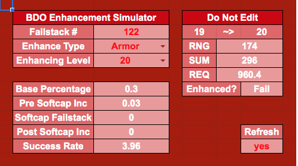
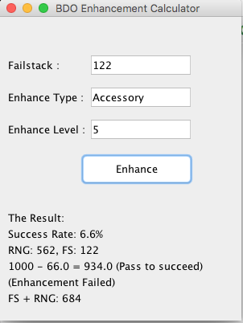
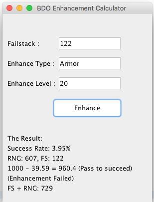
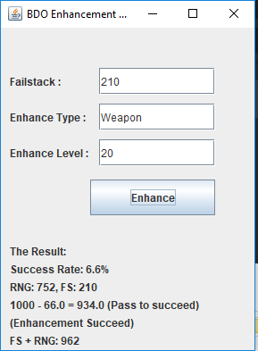

### *Name: Chanyu C.*

### Program Name: Black Desert Online Random Number Generator Simulator

### Description: 
``` 
Simple Java + GUI script on BDO RNG Simulation.
Black Desert Online is a popular MMORPG and this is based on their
formula of enhancing an item, which relies on RNG (luck).
With many of tinfoils floating around the internet, it'd rather be
better to just program the actual program to play around with it.
```

### 1st - Google Spreadsheet Version:
<a href = "pic1.png">

### 2nd - Java GUI Program:
<a href = "pic2-1.png">
<a href = "pic2-2.png">

### 3rd - Executable Program:
<a href = "pic3.png">